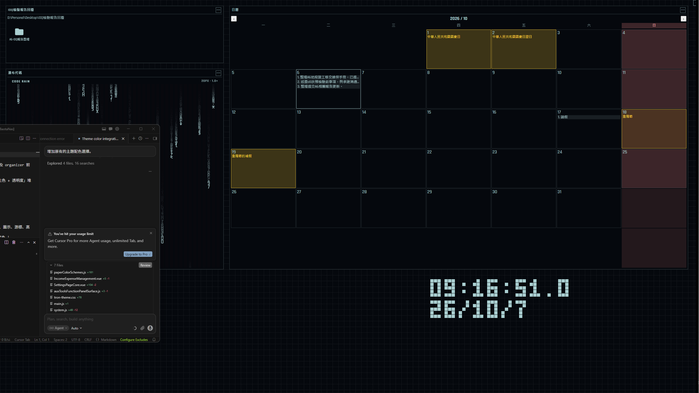

# eDEX Desktop Organizer

基於 [eDEX-UI](https://github.com/GitSquared/edex-ui) 改造的 **Windows 多螢幕桌面整理工具**。  
保留 eDEX 的科幻終端／黑客桌面視覺語言（近黑背景、青白主色、網格壁紙、HUD 容器），把原本偏演示用的全螢幕介面改成可長期覆蓋在系統桌面上的整理工作台。

## 程式說明

本專案不是原版 eDEX 的終端模擬器，而是：

1. **沿用 eDEX 的視覺與面板語彙**  
   主題色、字體、邊框、地球儀、代碼雨、CPU／記憶體／流量等監控面板風格，皆來自 eDEX 主題與模組 CSS。
2. **改造成桌面整理殼層**  
   以透明覆蓋視窗鋪滿各顯示器，隱藏系統桌面圖示，改由容器承載檔案、捷徑、磁碟與日曆等實用功能。
3. **整體黑客桌面風格**  
   深色網格壁紙、尖銳直角邊框、等寬／科幻字體、低透明度面板層疊，呈現終端機式的桌面氛圍。

| eDEX 原概念 | 本工具對應 |
| --- | --- |
| SYSTEM 側欄 | 系統／硬體／CPU／記憶體／進程等監控容器 |
| TERMINAL 中央區 | 系統桌面與路徑容器（檔案網格／列表） |
| NETWORK 側欄 | 本機磁碟、地球視圖、網路流量 |
| FILESYSTEM / KEYBOARD | 快速搜尋、日曆事項、容器選單與設定 |

## 介面截圖

### 整體黑客桌面

左右監控與網路面板、中央桌面／路徑容器，背景為網格壁紙。


### 日曆、時鐘與代碼雨

月曆格顯示澳門假期與事項預覽；時鐘為點陣 LED；可疊加 Matrix 風格代碼雨。



### 系統桌面容器

依格式大類篩選（資料夾／圖標／檔案／圖片等）；資料夾可右鍵「加入為路徑容器」，並支援標記色。


## 主要功能

- **多螢幕覆蓋**：每台顯示器獨立視窗；主螢幕可開設定；網格密度依主螢幕尺標同步
- **容器系統**：拖曳／縮放／鎖定／背景色；關閉與位置會寫入本機設定
- **桌面整理**：按資料夾／圖標／檔案格式篩選；可選是否遷移到「分類／副檔名」資料夾
- **路徑容器**：將資料夾加入為獨立瀏覽區
- **日曆事項**：雙擊日期編輯；可複製到微信
- **快速搜尋**：本機／額外根目錄檔名搜尋，字級可在設定調整
- **主題壁紙**：eDEX 主題 JSON + 網格／掃描線等壁紙樣式

## 執行

```powershell
cd organizer
npm install
npm start
```

## 編譯 Windows 安裝程式

```powershell
cd organizer
npm install
npm run dist
```

產出：`dist/eDEX-Desktop-Organizer-Setup-1.0.0.exe`（NSIS，可改安裝目錄）。

## 發佈

- 倉庫：https://github.com/bananamax9113/edex-desktop-organizer  
- Release：https://github.com/bananamax9113/edex-desktop-organizer/releases  

## 授權與來源

- 本工具衍生自 eDEX-UI（GPL-3.0）的視覺與部分前端資源  
- 主題與模組樣式參考 `src/assets`／eDEX 原版 CSS  
- 配色補充說明見 [`tron-theme.md`](tron-theme.md)
